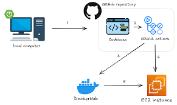
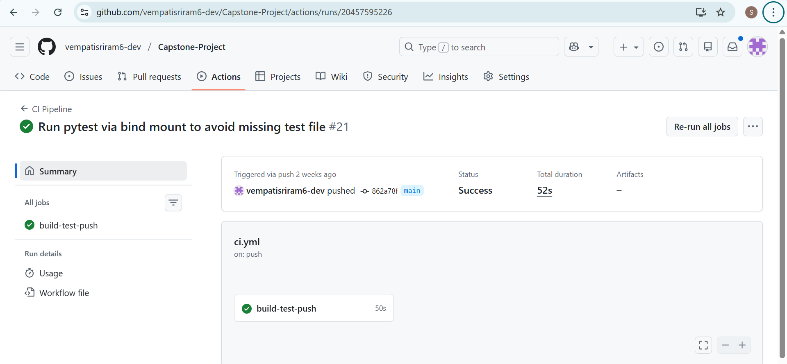
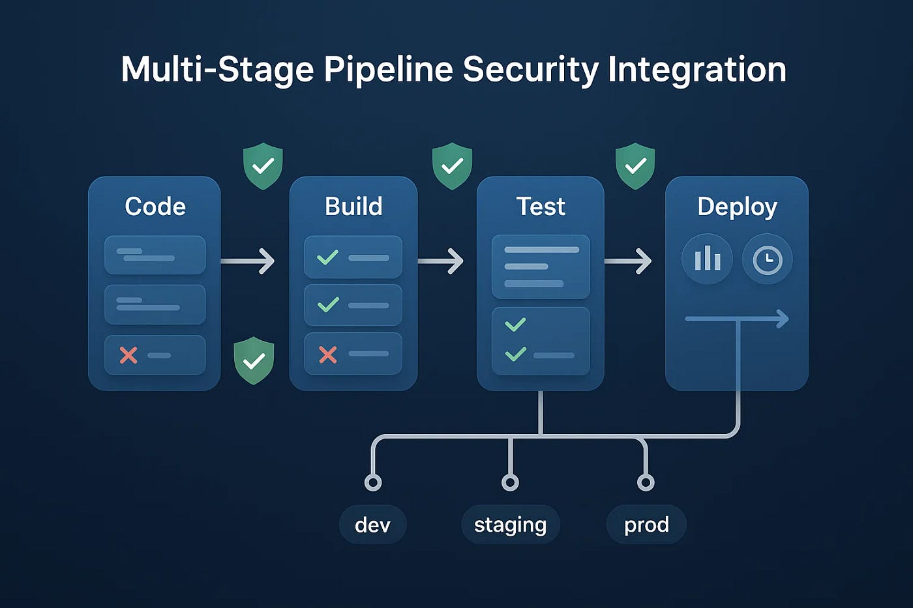
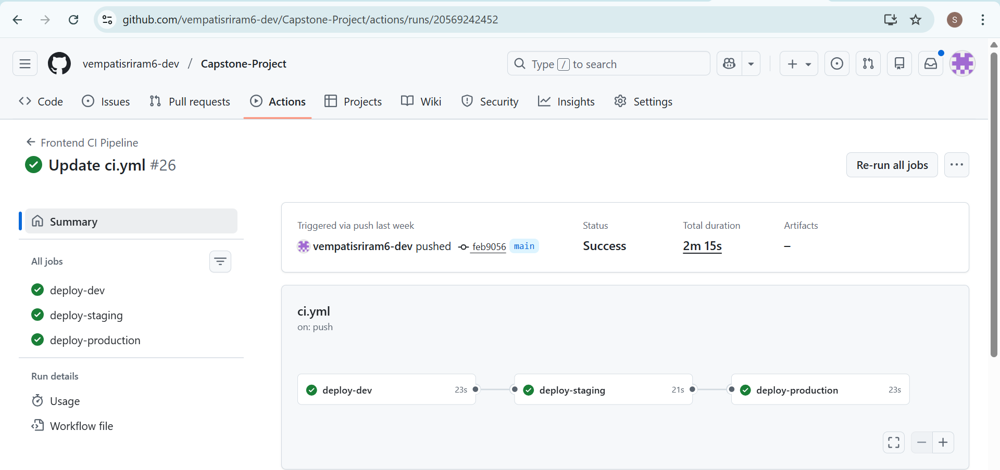
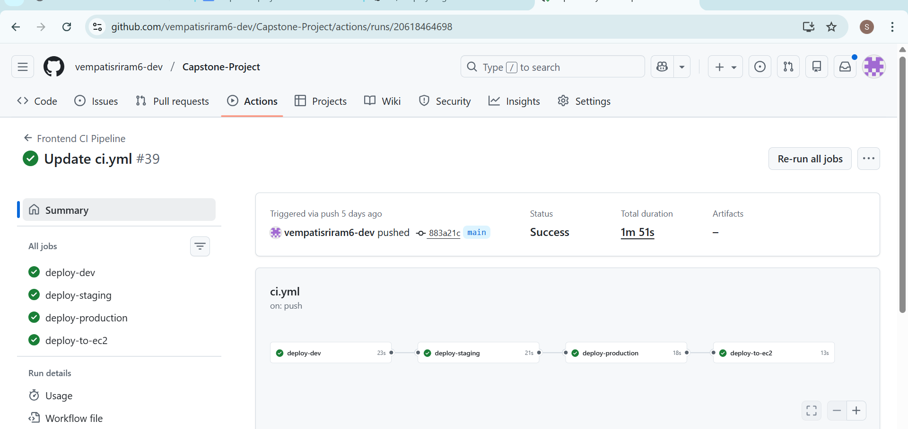
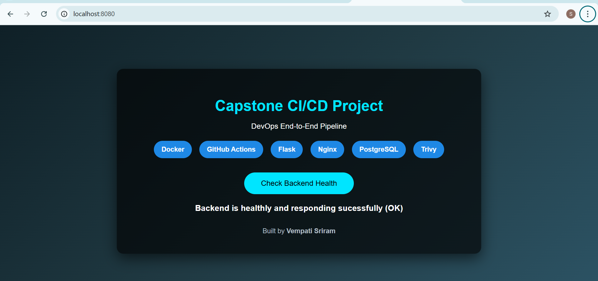
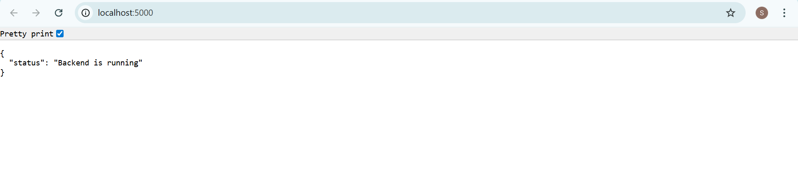

# End-to-End CI/CD Pipeline using GitHub Actions, Docker & AWS (Capstone-Project)
* This project demonstrates a complete CI/CD pipeline for a 2-tier web application using modern DevOps practices.

* The system automatically builds, tests, scans, and deploys applications across multiple environments using Docker, GitHub Actions, and AWS EC2.

* The goal of this capstone is to simulate a real-world DevOps workflow from development to production with security, reliability, and automation.
---
# Project overview

This repository demonstrates how to build a CI/CD pipeline from zero, starting with source code and ending with a production deployment.

### The pipeline automatically :  ###

* Developed a 2-tier web application locally in VS Code
* Containerized frontend and backend using Docker
* pushed source code to GitHub
* Created GitHub Actions CI pipeline
* Added GitHub repository secrets
* Automated:
  * Docker
  * Unit Testing
  * Trivy security Scanning
  * Image push to Docker Hub
* Deployed the application to AWS EC2
* Verified deployment using healthchecks
* implemented rollback mechanism for failures
 --- 
# Application Architecture

## 2-Tier Architecture

### **Frontend** ###

* Static HTML + CSS UI
* Served using Nginx
* Lightweight and optimized container

### **Backend** ###

* Flask REST API
* Health check endpoints
* Database connectivity
* Runs as a non-root user

### **Database** ###
* PostgreSQL (containerized)
  
### **CI/CD** ###

* GitHub Actions
* Docker Hub registry

### **Deployment** ###

* AWS EC2 using SSH
* SSH-based automated deployment
---
#  Tech Stack

| Category | Technologies |
|--------|-------------|
| Frontend | HTML, CSS, Nginx |
| Backend | Python, Flask |
| Database | PostgreSQL |
| Containers | Docker, Docker Compose |
| CI/CD | GitHub Actions |
| Security | Trivy |
| Cloud | AWS EC2 |
| Testing | Pytest |
| Automation | Bash |
---
# CI/CD Architecture

```
Developer
   ↓
GitHub Repository
   ↓
CI Tool (Jenkins / GitHub Actions)
   ↓
Build & Test
   ↓
Docker Image Build
   ↓
Security Scan (Trivy)
   ↓
Push to Docker Hub
   ↓
Deploy to Server (EC2 / VM)

```


---
# Project Structure

```
Capstone-Project/
│
├── frontend/
│   ├── index.html
│   ├── nginx.conf
│   └── Dockerfile
│
├── backend/
│   ├── app.py
│   ├── requirements.txt
│   ├── Dockerfile
│   └── tests/
│       └── test_app.py
│
├── scripts/
│   ├── deploy.sh
│   ├── healthcheck.sh
│   ├── rollback.sh
│
├── docker-compose.yml
├── .github/workflows/ci.yml
└── README.md

```
---
# Docker Implementation

### Backend Dockerfile
- Multi-stage build for optimized image size
- Lightweight Python base image
- Runs as a non-root user for security
- Uses environment variables for configuration

### Frontend Dockerfile
- Uses Nginx Alpine image for minimal footprint
- Serves static HTML and CSS content
- Custom Nginx configuration for routing
---
# Testing Strategy
Testing is critical part of this CI/Cd pipeline to ensure that only reliable and verified code is deployed to higher environments.

* unit tests written using pytest
* Tests executed inside Docker containers
* Automated Test Execution in CI Pipeline
* pipeline fails if tests fail

  

---
# Security Scanning
* Trivy Scans both frontend and backend images
* Detects HIGH and CRITICAL vulnerabilities
* Scan results displayed in pipeline logs

 
 
 

---
# CI/CD Pipeline (GitHub Actions)
### Pipeline Stages
1.checkout Source Code

2.Build Docker Images

3.Run Unit Tests

4.Trivy Security Scan

5.Push Images to Docker Hub

6.Deploy to EC2 (CD)

---
#  Environment-Based Deployments (Dev,Staging & Production)
* This project follows real-world DevOps Practices deploying the application across three environments using GitHub Actions Environments:
  
### The following environments were created:
* Dev
* staging
* production
### Each environment can have:
* Its own secrets
* protection rules
* Manual approval gates (for production)
  
## 1.Development Environment (Dev)
### purpose:
The Dev enviroment is used for:
* Continuous Development
* Frequent testing
* Fast feedback on code changes
### How It Works:
* Triggered automatically on every push to main
* Uses development environment variables
* No manual approvals
* Fastest deployment cycle
### why Dev Is Important
 * Catches bugs early 
 * Quick iteration
 * Safe experimentation

 ## 2.Staging Environment
  ### Purpose:
* The Staging environment acts as a production-like testing environment.
## It ensures:
* Final verification before production
* Security scans are validated
* Deployment scripts are tested safely
### How It Works
* Triggered after successful CI
* Uses staging-specific secrets
* Same Docker images as production
* No manual approval required
### Why Staging Is Important
  * Reduces production failures
  * Mirrors real production behavior
  * Confidence before release

## 3.Production Environment
### Purpose:
* The Production environment serves real users and must be protected.
### How It Works
* Deployment requires manual approval
* Uses production secrets only
* Health checks are mandatory
* Rollback enabled on failure
### Protection Rules Used
* Required reviewers
* Manual approval before deployment
* Audit logs maintained
### Why Production Is Protected
  * Prevents accidental deployments
  * Ensures stability
  * Enterprise-grade safety
    



---
# Deployment to AWS EC2
* Deployment is automated using SSH from GitHub Actions:
  * pull latest Docker Image
  * Stop older containers
  * Remove old containers
  * Run new containers
  ```
   docker pull vempatisriram2004/capstone-frontend:latest
   docker stop frontend || true
   docker rm frontend || true
   docker run -d -p 80:80 vempatisriram2004/capstone-frontend:latest
  ```
  
---

# Application Access

###  Local Development URLs

- **Frontend Web Application**  
   http://localhost:8080
  
- **Backend Root Endpoint**  
   http://localhost:5000
  
- **Backend Health Check API**  
   http://localhost:5000/health
   
  
  
  
  
  
--- 

# What I Learned
* Real-world CI/CD pipeline design
* Docker best practices
* GitHub Actions workflows
* Secure container scanning
* production-safe deployments
* Rollback and reliability strategies
---

# Conclusion

* This project demonstrates real-world Devops engineering skills,including CI/CD automation,containerization,security scanning ,cloud deployment and production reliability.

* It serves as a portfoilo-ready capstone project showcasing modern Devops practices from development to production.
  
 --- 
# Author Details
```
 Name: Vempati Sriram  
 GitHub:https://github.com/vempatisriram6-dev
 ```

  
